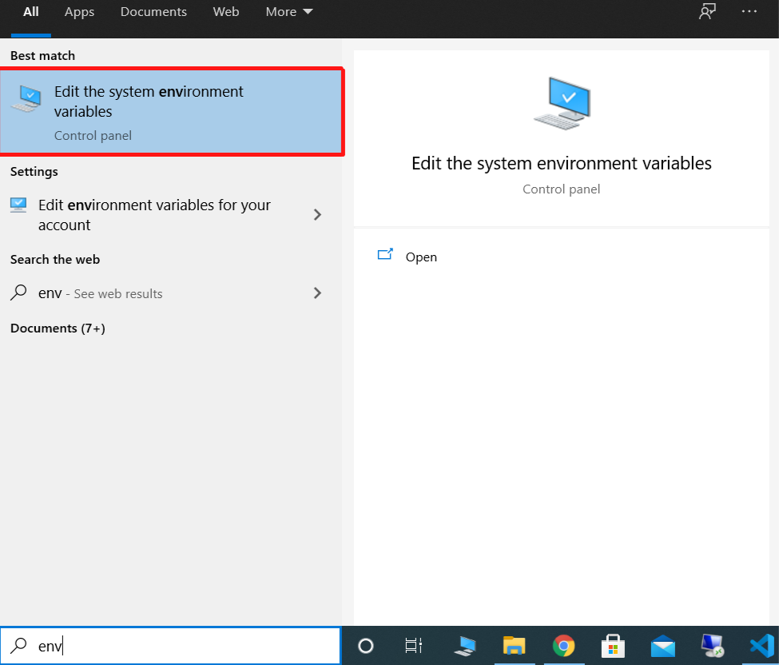
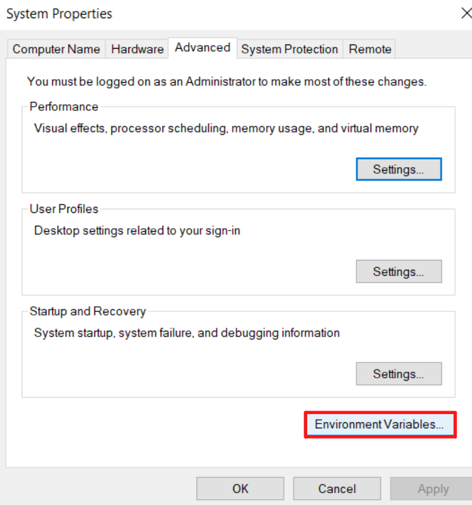
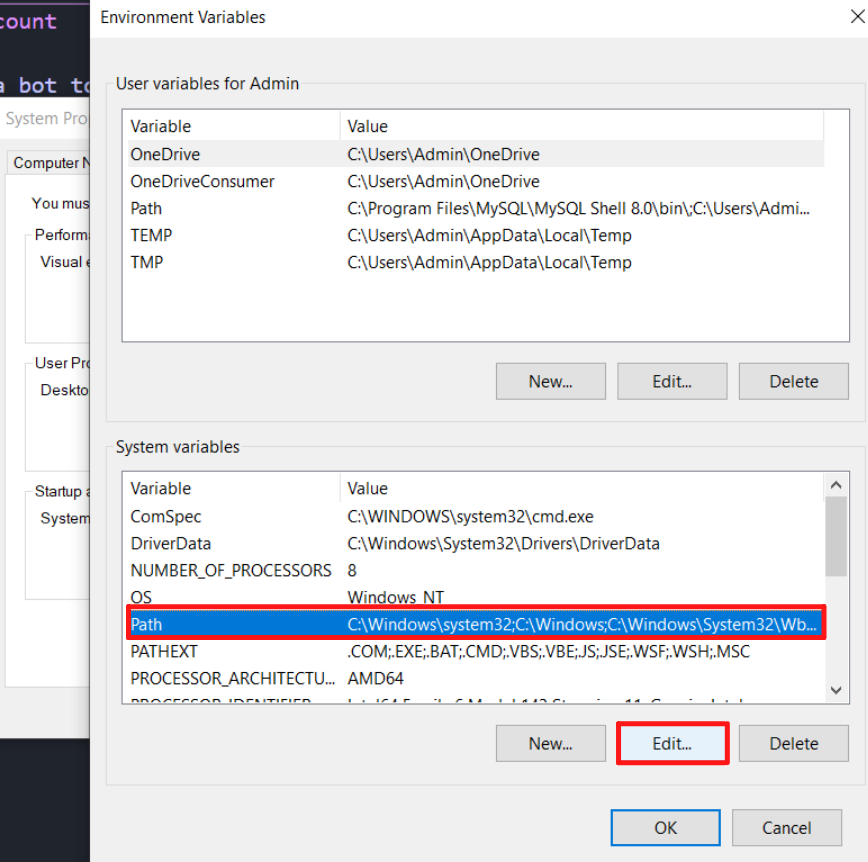
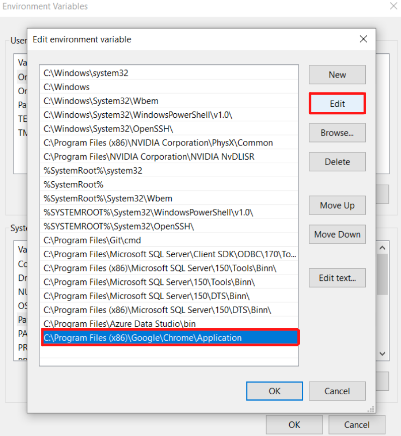

# IG-DM-count

This is a bot to count instagram dms exchanged between two people. Here's how to use it  

1. Edit the `conf.py` file, Enter your username and password
2. Install the requirements.txt preferably in a virtual environment
3. Open cmd and run `WHERE chrome`, it should look something like this `C:\Program Files (x86)\Google\Chrome\Application\chrome.exe` 
remove the chrome.exe part so your final path should be `C:\Program Files (x86)\Google\Chrome\Application`. In case you have installed it on a different location dont worry use your location
4. Now you need to add chrome to your environment path variables so follow the steps given in the following images

    

    

    

    

5. Create a folder somewhere on your computer and copy-paste its path instead of the `<your dir>` filed in the next step
6. Now again open cmd and run `chrome.exe --remote-debugging-port=9222 --user-data-dir=<your dir>`
7. Run the `scrollbot.py` using this command --> `python -i scrollbot.py` The `-i` flag is not necessary but it will allow you to interact with your browser in real-time. Now once the bot clicks through all the buttons and redirects you to your inbox you will manually need to select an account whose dms you want to count. You will also see a promt that says `Press enter after selecting a user` hit enter and then hit enter again to start scrolling to the top.
8. Once you reach the top of your dms you'll still have a repl `>>>` to interact with
9. Open another instance of cmd in the same folder and run the `countbot.py`
